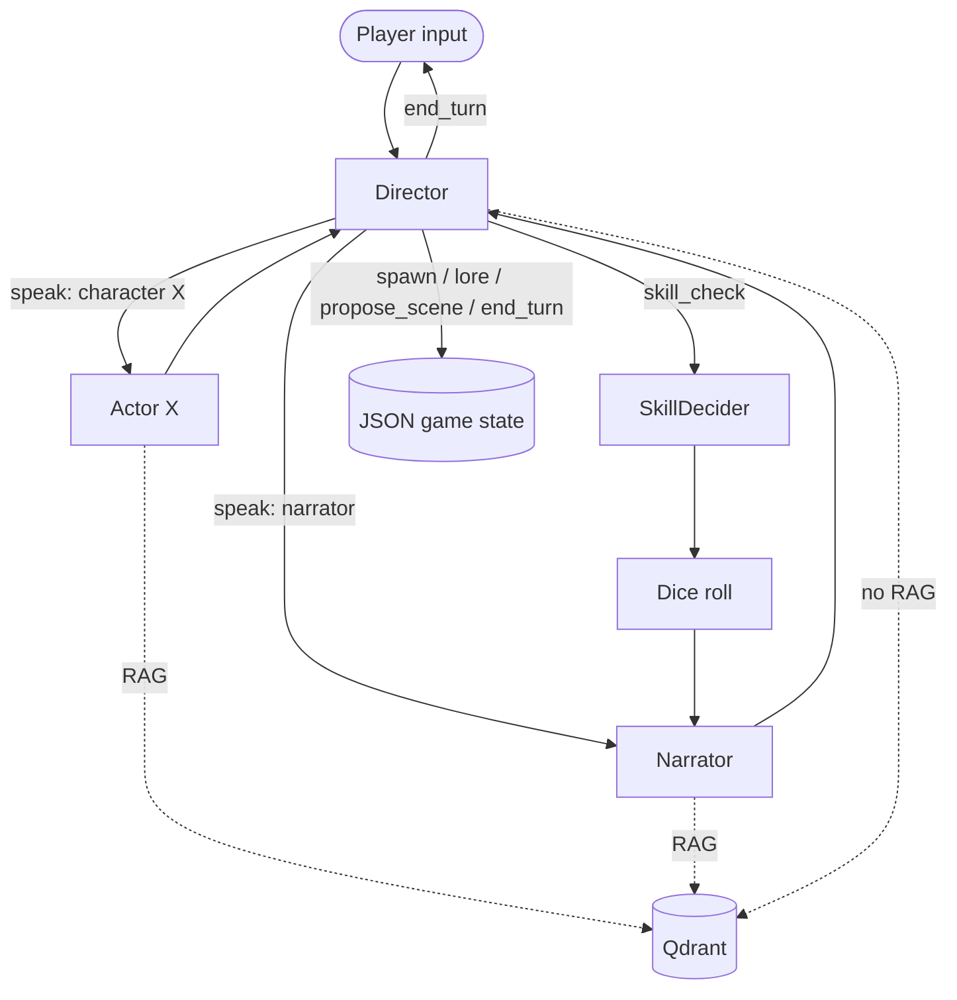

# TTRPG Tavern Architecture Overview

TTRPG Tavern is a fork of SillyTavern aimed at one experience: tabletop-style
play with a player character, an AI Director that orchestrates each turn, an
AI World Narrator that writes prose, and AI-controlled characters that react
to the player.

This document is the single high-level map of the system. Detailed
discussions live in the sibling docs and the ADRs.

## What this fork is, and is not

TTRPG Tavern **is**:

- A campaign-first reshaping of SillyTavern's UX: the launch screen is a
  Campaign Manager; the play surface is a Scene; chat is a building block,
  not a top-level concept.
- An in-process Node app. All Director / Narrator / actor / skill-check /
  RAG / ruleset / scene-end logic runs inside this repo (see
  [ADR 0002](../adr/0002-all-node-no-python.md)).
- File-based for game state (JSON / JSONL), Qdrant for vectors only (see
  [ADR 0003](../adr/0003-json-state-qdrant-vectors.md)).

TTRPG Tavern **is not**:

- A SillyTavern extension. We modify the host directly (see
  [ADR 0001](../adr/0001-fork-not-extension.md)).
- A scene = ST group chat layering. Scenes are first-class objects with
  their own schema (see [ADR 0004](../adr/0004-cannibalize-st-chat-substrate.md)).
- A Python sidecar app. The prior `srstavern` Python codebase is reference
  only.

## Roles

- **Player** — the human; controls one player character (PC).
- **Player Character (PC)** — the player's identity in scenes. Has a sheet,
  stats, items, statuses, skills, notes; persists between scenes.
- **Director** — an LLM that emits structured output only (no prose).
  Decides who speaks next, whether a skill check is needed, and when the
  turn ends. Sees a small recent chat window, intent, and game state.
  Never sees RAG memory snippets.
- **World Narrator** — an LLM that writes prose for the world: setting
  description, what happens, consequences after rolls. Sees world-fact RAG
  but no character memories.
- **Actor (AI character)** — an LLM persona for any non-player character
  in the scene. Sees its own sheet, its own character memories, world facts,
  and a small recent transcript. Never sees other characters' sheets or
  memories.
- **Player Tools** — the UI layer the player drives: Campaign Manager,
  Campaign Main, Scene view, sheet panel, party panel, scene state panel.

## Top-level navigation flow

```
Campaign Manager  -->  Campaign Main  -->  Scene  -->  back to Campaign Main  -->  ...
   |                       |                |
   create / load           start scene      end scene (player triggered)
```

Chat history, character cards, and world info are not entered through the
left-nav drawer in TTRPG mode. They are reachable through the campaign and
scene shells.

## Per-turn flow inside a scene

When the player submits input in an active scene, the GM core takes over.
See [program-flow.md](program-flow.md) for the full event list.



The Director loop runs to a step cap (default 8) and ends only when it
emits `end_turn`. Each Director decision is a discriminated union; see
the schemas in `src/gm-core/director/schemas.d.ts` (planned).

## Context isolation

A persistent rule across all actor calls: **per-actor prompts are rebuilt
from authoritative state every time**. The transcript displayed to the
player is not the prompt sent to any LLM. Specifically:

- The Director receives a recent chat-window text tail, intent, and a
  trimmed list of actors. No RAG snippets.
- The Narrator receives intent, transcript tail, and world-fact RAG only.
- An actor X receives intent, transcript tail, X's full sheet rendered as
  YAML, X's character-memory RAG, and world-fact RAG. Nothing else.
- Director rationale never reaches actors.

This is enforced in the prompt builders, not by polite convention. RAG
snippets are spliced into the prompt for one call; they are never
persisted to the transcript.

## Storage

- **JSON game state** — per-user, per-campaign, on disk. See
  [ADR 0003](../adr/0003-json-state-qdrant-vectors.md) for the layout.
- **Qdrant** — `character_memory__{character_id}` and
  `world_fact__{campaign_id}` collections. Strict per-call scoping; no
  cross-scope queries.
- **ST character cards** — mirrored from campaign characters for in-scene
  avatar/identity display. Card files are downstream; campaign character
  JSON is upstream.
- **Rulesets** — bundled YAML at `data/rulesets/{ruleset_id}/`; user
  packs at `{handle}/rulesets/{ruleset_id}/`.

## Phasing

- Phase 0 — bootstrap (this layout, docker-compose, docs).
- Phase 1 — Campaign-first shell (visual replacement of welcome screen).
- Phase 2 — Character + sheet model + creation wizard.
- Phase 3 — Scene shell (no AI yet).
- Phase 4 — Director + Narrator (`speak` + `end_turn`).
- Phase 5 — Multi-actor with strict context isolation.
- Phase 6 — Skill checks + first ruleset (D&D 5e).
- Phase 7 — RAG (Qdrant) wired into actor and narrator calls.
- Phase 8 — Scene-end summary + memory extraction pipeline.
- Phase 9 — Strict-GM evals.
- Phase 10 — Polish: multi-model role config, ruleset picker, lore editor,
  memory inspector, campaign import/export.

See the plan file at `.cursor/plans/` for the live phase status.

## Reference

The prior `srstavern` work lives at `../srstavern/` relative to this repo.
That includes:

- `../srstavern/docs/architecture/` — deeper writeups we are porting and
  adapting (program-flow, director-and-rules, history-and-memory,
  context-and-prompts).
- `../srstavern/legacy/sidecar/srstavern/` — the Python sidecar
  implementation. We are not running it; we are reading it for prompts,
  schemas, ruleset YAML, and eval scenarios.
