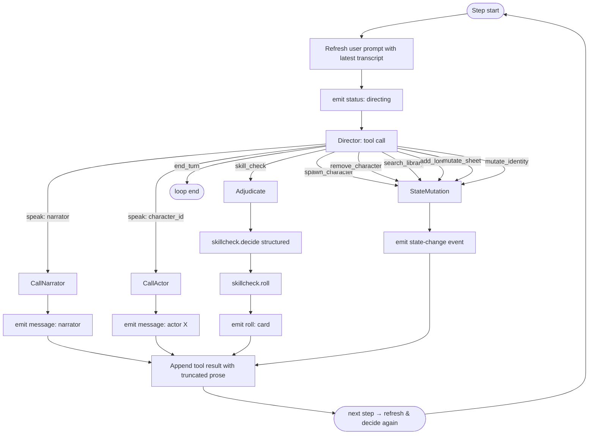

# Program flow: a player turn

This is the canonical event sequence for a single player turn inside an
active scene. Phase numbers refer to the roadmap in
[README.md](README.md#phasing); the full flow is realized incrementally.

## Entry point

The frontend Scene view owns the input bar. When the player submits text:

1. Append the player's message to the local transcript and to the on-disk
   JSONL via `addOneMessage()` and the GM core's transcript writer.
2. Pre-empt SillyTavern's `Generate()` so it does not run the standard
   chat-completion pipeline. The exact mechanism is the GM-mode-aware
   short-circuit at the start of `Generate()` (see
   [ADR 0004](../adr/0004-cannibalize-st-chat-substrate.md)).
3. POST to `/api/gm/turn` with `{ campaign_id, scene_id, user_input }`.
   The response is `application/x-ndjson`: one `TurnEvent` per line.
4. Stream-parse each line and render it.

## Server-side: the Director loop

`src/gm-core/director/loop.js` runs a bounded tool-calling agent loop
(default cap: 8 steps). The Director communicates exclusively through
OpenAI-style tool calls (`tool_choice: 'required'`). Each iteration:

1. **Refresh context.** The user prompt (`directorHistory[1]`) is
   rebuilt from `directorUserPrompt(ctx)` every step so the Director
   sees the latest `recent_transcript` — including narrator/actor lines
   emitted earlier in the same turn.
2. **Call the Director.** `directorClient.tool({ messages: directorHistory, tools: directorTools, tool_choice: 'required' })`.
3. **Dispatch.** Based on the selected tool name, the loop dispatches
   the action and appends the result as a `role: 'tool'` message keyed
   by `tool_call_id`.



### Director history layout

The loop maintains a `directorHistory: ChatMessage[]` array:

```
[0]   system prompt (stable)
[1]   user prompt (refreshed each step with latest transcript + RAG)
[2]   assistant: { content: null, tool_calls: [{ id, name, arguments }] }  ← decision 1
[3]   tool:      { tool_call_id, content: <engine result for decision 1> }
[4]   assistant: { content: null, tool_calls: [{ id, name, arguments }] }  ← decision 2
[5]   tool:      { tool_call_id, content: <engine result for decision 2> }
...
```

Tool results include truncated prose from narrator/actor speak actions
so the Director can see what was said and decide whether to continue or
`end_turn`.

### RAG injection

The Director receives:
- `world_lore` top 6
- `director_memory` top 2
- `player_journal` top 1

Narrator and Actor calls get their own per-role RAG slices via
`memoryService.for_narrator()` and `memoryService.for_character()`
respectively.

### Parse resilience

If the LLM fails to produce valid JSON/tool calls after 3 fallback
attempts, the loop emits a `parse_failed` error and ends the turn with
`reason: 'degraded'` instead of crashing. This avoids orphaned tool-call
pairing violations.

## TurnEvent kinds

The NDJSON stream emits one `TurnEvent` per line:

- `status` — Director phase change (`directing`, `awaiting_actor`,
  `rolling`, `closing`).
- `message` — a finished message from Narrator or an actor. Carries
  `{ actor, name, role, text, actor_id? }`.
- `roll` — a transparent skill-check card with `{ actor_id, actor_name,
  intent, card }`.
- `state` — game-state mutation (`spawn`, `remove`).
- `sheet_mutated` — sheet ops applied to a character.
- `identity_mutated` / `identity_edit_request` — identity field changes
  (immediate for NPCs, approval-gated for PCs).
- `memory_write` — a RAG record was persisted.
- `error` / `tool_error` — error events.
- `end_of_turn` — sentinel; loop is done. Reason: `director` | `cap` |
  `error` | `degraded` | `aborted`. Frontend stops reading.

The frontend renders each kind via a dedicated path that reuses
`addOneMessage()` for prose and a custom template for `roll` and `state`.

## Per-actor prompts

Every Narrator and actor call is built from authoritative state. The
Director prompt and prior actor outputs are not chained; each call gets a
fresh user prompt. This is enforced in the prompt builders:

- `src/gm-core/director/prompts.js` (system + user for the Director)
- `src/gm-core/narrator/prompts.js` (system + user for the World Narrator)
- `src/gm-core/actors/prompts.js` (system + user for any character actor)

Inputs each prompt is allowed to see, and not see, are listed in
[../adr/0004-cannibalize-st-chat-substrate.md](../adr/0004-cannibalize-st-chat-substrate.md)
and the to-be-ported `context-and-prompts.md`.

## Skill check resolution

Two LLM calls plus a deterministic roll, when the Director picks
`skill_check`:

1. **Adjudicator** — `skillcheck.decide()` with a structured
   `SkillCheckDecision` schema. Output: `{ required, skill, dc, ability,
   failure_severity, justification }`. We clamp DC against the active
   ruleset and override `ability` from the ruleset when the LLM disagrees.
2. **Roll** — `skillcheck.roll()` is pure. d20 + ability modifier from
   the actor's sheet + proficiency bonus when the actor is proficient.
   Returns `RollOutcome { d20, modifier, total, success, margin }`.
3. **Post-roll speak** — the Director MUST pick `speak` next to deliver
   the consequence. The loop enforces this via `pendingPostRollSpeak`.

A "no check needed" decision emits a status event and lets the Director
pick again.

## Scene end

The player triggers scene end from the Scene view (button, not a slash
command). The frontend POSTs the trimmed transcript to
`/api/gm/scenes/{id}/end`. Server-side `src/gm-core/scenes/end-pipeline.js`
runs:

1. Structured `SceneSummary` LLM call.
2. Per-participant `MemoryExtraction` LLM call.
3. Write extracted memories to `character_memory__{id}` collections.
4. Write key events to `world_fact__{campaign_id}`.
5. Mark scene `closed` in JSON state. Frontend returns to Campaign Main.

The pipeline is pure-functional in the LLM-call sense: idempotent if you
run it again on the same transcript with the same scene ID.

## What does not happen

- The Narrator never sees character memories.
- Actor X never sees actor Y's sheet or memories.
- RAG snippets are never persisted to the transcript.
- ST's group-chat scheduler is never used; there are no groups for
  scenes.
- ST's character-list welcome flow does not run when GM mode is active.

These are properties of the system, not coincidences of any one
implementation file.
